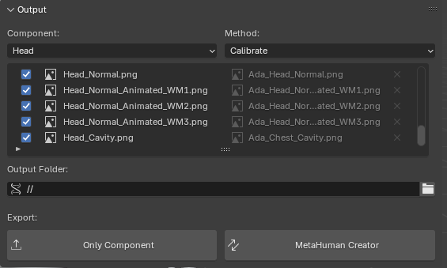

# Output
This panel contains all the properties and operators that control how data is output from Blender.

{: class="rounded-image center-image"}

## Properties
#### Method
The output method to use when creating the dna file

1. **Calibrate** - Uses the original dna file and calibrates the included bones and mesh changes into a new dna file. Use this method if your vert indices and bone names are the same as the original DNA. This is the recommended method.

2. **Overwrite** - Uses the original dna file and overwrites the dna data based on the current mesh and armature data in the scene. Use this method if your vert indices and bone names are different from the original DNA. Only use this method when the calibration method is not possible.

!!! warning
    The `overwrite` method is very new and still experimental. This currently doesn't work in all cases and is still being worked on.

#### Asset List
This displays a list of all the mesh objects, the armature objects, and images that will be output during the export process. Assets can be un-checked to exclude them from the export. Also, the name on the left is editable.

!!! note
    Mesh names should follow the LOD naming convention that Metahuman's use. This is how the exporter will know which LOD level to assign a mesh to.

#### Output Folder
This is a single path to the folder where all the data will be exported. The `.dna` components will be put in this folder, and textures are exported to a `Maps` folder within this directory.

## Operators
### Export Only Component
Export only the selected component (`head`, `body`) to a single DNA file. No textures or supporting files will be exported. This is faster then running a full export, especially if you only need to update the DNA of 1 component.

### Send to MetaHuman Creator
Exports the MetaHuman DNA head and body components, as well as, textures in a format supported by MetaHuman Creator.